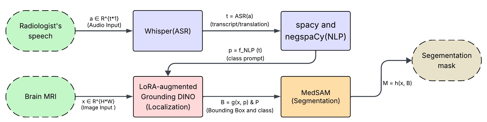

# LoGSAM

LoGSAM is a lightweight pipeline for turning radiology speech into a tumor-class prompt that can support downstream localization and segmentation workflows.

The repository currently includes two implemented stages:

1. **Speech transcription and translation** using Whisper  
2. **Clinical NLP class extraction** using spaCy and negspaCy

The high-level idea is:

**German radiology speech -> German transcript + English translation -> tumor class extraction -> class prompt for downstream models**



## Repository Structure

```text
LoGSAM-main/
├── Model/
│   ├── whisper/
│   │   └── main_de_en.py
│   └── clinical_nlp/
│       ├── nlp.py
│       ├── data/
│       │   └── transcripts/
│       └── outputs/
├── pipeline.png
├── README.md
└── LICENSE
```

## Implemented Components

### 1. Whisper-based transcription and translation
`Model/whisper/main_de_en.py`:
- loads a local Whisper checkpoint
- transcribes German audio into German text
- translates the same audio into English
- saves both outputs as `.txt` files

### 2. Clinical NLP tumor-class extraction
`Model/clinical_nlp/nlp.py`:
- reads transcript `.txt` files
- detects tumor-related terms with spaCy
- handles negation with negspaCy
- maps negative findings to `healthy`
- saves per-case outputs as:
  - `.json`
  - `.csv`
  - class-only `.txt`

## Requirements

Create a virtual environment and install the Python dependencies:

```bash
python -m venv venv
source venv/bin/activate
pip install --upgrade pip
pip install -r requirements.txt
python -m spacy download en_core_web_sm
```

### `requirements.txt`

```txt
torch
openai-whisper
spacy
negspacy
```

## Additional System Requirement

Whisper usually requires **FFmpeg** to be installed on your system.

For Ubuntu/Debian:

```bash
sudo apt update
sudo apt install ffmpeg
```

## Model Checkpoints

The code expects a local Whisper checkpoint file for transcription.

### Whisper
Place the Whisper model file in the same directory where you run the script, for example:

```text
large-v3.pt
```

The current script uses:

```python
model_path = Path("large-v3.pt")
```

## How to Run

## 1. Transcribe and translate an audio file

Go to the Whisper module directory and run:

```bash
cd Model/whisper
python main_de_en.py /path/to/audio_file.wav
```

This will generate:

```text
outputs/transcripts/<audio_name>_de.txt
outputs/transcripts/<audio_name>_eng.txt
```

## 2. Run clinical NLP on transcript files

Go to the clinical NLP directory and run:

```bash
cd Model/clinical_nlp
python nlp.py
```

By default, the script reads transcript files from the path defined in `nlp.py`:

```python
INPUT_DIR = Path("/home/hpc/iwi5/iwi5357h/whisper/outputs/translations")
```

You should update this path to match your local project setup before running the script.

The script writes outputs into:

```text
outputs/
outputs/classes/
```

Generated files per case:

```text
outputs/<case_id>.json
outputs/<case_id>.csv
outputs/classes/<case_id>.txt
```

## Output Format

### JSON / CSV fields
Each processed transcript contains:
- `case_id`
- `tumor_class`
- `is_positive`
- `evidence`
- `method`

### Tumor classes
The current rule-based target classes are:
- `glioma`
- `meningioma`
- `pituitary`
- `healthy`

## Notes

- `nlp.py` uses rule-based synonym matching through spaCy's `EntityRuler`.
- Negated tumor mentions are converted to `healthy`.
- If no tumor term is found, the output is also set to `healthy`.
- The synonym dictionary and global negative phrases can be customized inside `nlp.py`.

## Current Limitations

- The repository currently includes only the transcription/translation and NLP extraction stages in code.
- The downstream localization and segmentation components described in the project summary are not included in this archive.
- Some paths are hard-coded and should be adjusted before running locally.

## License

This project is released under the Apache License 2.0. See [LICENSE](LICENSE) for details.
