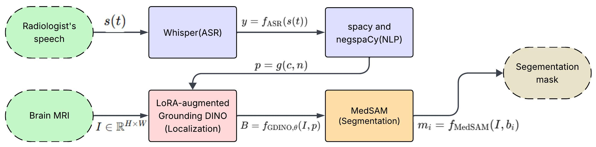

# LoGSAM
LoGSAM: Parameter-Efficient Multi-Modal Grounded Brain Tumor Segmentation in MRI via Low-Rank Adaptation(LoRA).

In this repository, we provide the official implementation of "LoGSAM",  a novel and efficient framework that converts radiologist dictation into tumor class cues and uses them to drive detection-to-segmentation with foundation models. Our approach involves transcription and translation of the radiologist’s speech with Whisper for downstream NLP. We extract a tumor class prompt using spaCy and handle negation with negspaCy. Then, we perform text-guided localization with Grounding DINO. For parameter-efficient domain adaptation, we inject low-rank updates into key vision–language components while keeping most parameters frozen (95.04\%). Finally, we prompt MedSAM with the predicted bounding boxes to obtain pixel-level tumor masks without fine-tuning the model. We evaluate LoGSAM on BRISC 2025 and additional out-of-distribution datasets.

## 🚀 Features

- 🔍 Language-guided object detection
- 🧠 Multimodal fusion (vision + language)
- ✂️ High-quality segmentation using MedSAM
- ⚡ Modular pipeline for experimentation
- 📊 Support for custom datasets and visualizations
  

## Method

## 📦 Model Setup

⚠️ Pretrained models are **not included** in this repository due to size constraints.

Download required checkpoints and place them inside:

## Checkpoints

| Model                | # Parameters  | Download                           |
|----------------------|--------------:|:----------------------------------:|
| GDINO-SwinT          | 86 M          | [Checkpoint](https://github.com/IDEA-Research/GroundingDINO/releases/download/v0.1.0-alpha/groundingdino_swint_ogc.pth) |
| LoRA-DINO            | 86 M          | [Checkpoint](https://drive.usercontent.google.com/download?id=1tUyGY2KEUEmDoa78CnNOUF44e-a5oOgI&export=download) |
| MedSAM-ViT_b         | 91 M          | [Checkpoint](https://dl.fbaipublicfiles.com/segment_anything/sam_vit_b_01ec64.pth) |
| Whisper_large_v3     | 1550 M        | [Checkpoint](https://openaipublic.azureedge.net/main/whisper/models/e5b1a55b89c1367dacf97e3e19bfd829a01529dbfdeefa8caeb59b3f1b81dadb/large-v3.pt) ||

## License
This repository is released under the Apache License 2.0. See [LICENSE](LICENSE) for additional details.

## Acknowledgement
1. https://github.com/Asad-Ismail/Grounding-Dino-FineTuning
2. @article{MedSAM,
  title={Segment Anything in Medical Images},
  author={Ma, Jun and He, Yuting and Li, Feifei and Han, Lin and You, Chenyu and Wang, Bo},
  journal={Nature Communications},
  volume={15},
  pages={654},
  year={2024}
}
3. https://github.com/openai/whisper
4. https://spacy.io/

